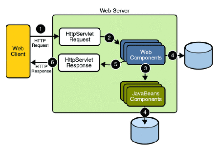
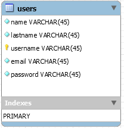

# AMT Project (Development of a Multi-Tiered App)


Date: 10/20/2016

Version 1.0

##Introduction
In this repository we have a web application that runs on a wildfly server in which the application is autodeployed.  
The application is launch via a docker container.
The principal objectif ot the  project is to apply the technologies, techniques and design patterns (MVC, DAO) presented during the Multi-Tiered Application course. We used Java EE application server, netbeans to develop the web application, and JAX-RS API in order to have a Restfull application.

##Goal
1. *Design and implement a page with a login and registration form*

2. *Implement a security filter to protect pages from unauthenticated users in other words   create a uesr space*

3. *Allow registered users to login and access protected pages(user space) and not access them anymore once they're not logged in*
4. *implement a REST API with JAX-RS*
5. *Use the DAO design pattern and JDBC to interact with the relational mysql database*

##Team members
Pascal Sekley : <pascal.sekley@heig-vd.ch>

Rodrigue Tchuensu : <rodrigue.tchuensu@heig-vd.ch>

##Requirement  
1 - Install docker and docker-compose if not yet done. Click [here](https://www.docker.com/products/docker-toolbox) to install.  
2 - Clone this repo to a folder of your choice.
````
git clone git@github.com:pascalsekley/Projet-AMT.git (if you have an ssh configuration on github)  
git clone https://github.com/pascalsekley/Projet-AMT.git (for https cloning)
````
3 - You can use [docker machine windows](https://docs.docker.com/docker-for-windows/) for windows is you're on windows platform. And [docker machine mac](https://docs.docker.com/docker-for-mac/) if you're on mac OS platform.

##How to Run   
Assuming that you have cloned this repo and that you have installed docker on your machine.
Once you're in the root you have to build the app. Let's compile the war first using the [Maven](https://maven.apache.org) command:

1 - `mvn compile war:war`. 

Copy the newly generated ".war" file  to the folder containing the wildfly dockerfile.

2 - `cp target/project-1.0-SNAPSHOT.war images/wildfly/`

Navigate to the folder named topology-amt of the cloned directory and fire up docker-compose to start the server :
  
`docker-compose up --build`  
Notice that once the server is started the application is automatically deployed on the wildfly server. Two other containers are launched when the above command is executed. One which run phpmyadmin and the other runs mysql.
**URL to Access** are :
````
http://192.168.99.100:9090 (wildfly server  welcome page)    
http://192.168.99.100:9090/project-1.0-SNAPSHOT (application)  
http://192.168.99.100:9990(console -> admin/admin)
http://192.168.99.100:6060(phpmyadmin console -> root/adminpw)    
````  

To access the management wildfly console use this link: `http://192.168.99.100:9990/console/App.html`

the username is admin and the password is admin

To access the phpmyadmin console use this link: `http://192.168.99.100:6060/`

the `username is root` and the `password is adminpw`

To know more about auto-deployment.
Click [here](https://hub.docker.com/r/jboss/wildfly)


##The database

> We decided to use as unique ID the username of a user which is supposed to uniquely identify a user in our database. The username is the primary key in that case.

##REST API
On using the REST ressources of our application, the entry point to our application is **_/api_**. Our implementation of REST makes it possible for a user to achieve the CRUD operations. As shown below we have a list of possible operations that can be achieved with our API.  


**Insert a user (Create)**
----
Creates a new user and add him to the list of registered users. If user username already exists the new user is not inserted in the list of registered users.

````
URL : /api/users 
Method : POST
URL PARAMETERS : none 
DATA PARAMETER : 
           {
	            "name": "test",
	            "lastname": "test",
                "username": "test",
                "email": "afsg@kfkf.com",
                "password": "test"
           }
           
SUCCESS RESPONSE :
               Code: 201 created
               Content: User Created
ERROR RESPONSE :
               Code: 409 Conflict
               Content:User not Created
NOTES :
````


**Show users (Read)**
----
Returns json data of all current registered users in tabulated form.

````
URL : /api/users 
Method : GET
URL PARAMETERS : none
DATA PARAMETER : none
SUCCESS RESPONSE :
        Code: 200 OK 
        Content: 
        [
            {
                "name": "Johnes",
                "lastname": "Indiana",
                "username": "admin",
                "email": "admin@amt.ch"
            },
            {
                "name": "Sekley",
                "lastname": "jessica",
                "username": "jessica",
                "email": "jessica@amt.ch"
             }
         ]
ERROR RESPONSE : -
NOTES :
````  

**Show a user (Read)**
----
Returns json data about a given registered user in a tabulated form.

````
URL : /api/users/{username}  
Method : GET
URL PARAMETERS : 
            Required:
            username
DATA PARAMETER : none
SUCCESS RESPONSE : 
        Code: 200 OK
        Content: 
        [
            {
                "name": "Johnes",
                "lastname": "Indiana",
                "username": "admin",
                "email": "admin@amt.ch"
            }
        ]

ERROR RESPONSE :
        Code: 404 Not Found
        Content: user not found 
NOTES :
````


**Modify a user  (Update)**
----
Update/Modify some of the attribute that characterises a user, except for the username.

````
URL : /api/users/{username}
Method : PUT
URL PARAMETERS :
            Required:
            username
DATA PARAMETER :
            {
	            "name": "toto",
	            "lastname": "tata",
                "email": "afsg@kfkf.com",
                "password": "123456789"
            } 
SUCCESS RESPONSE :
               Code: 200 OK
               Content: User has been modified successfully
ERROR RESPONSE :
               Code: 304 Not Modified
               Content: Failed to modify the user: Unidentified user
NOTES :
````


**Remove a user (Delete)**
----
Removes a given user from the the list of registered users.

````
URL : /api/users/{username}
Method : DELETE
URL PARAMETERS :
            Required:
            username 
DATA PARAMETER : none
SUCCESS RESPONSE :
            Code: 200 OK
ERROR RESPONSE :
            Code: 404 Not Found
            Content: User NOT found
NOTES :
````  


*Hope you enjoyed using our application, thanks for stopping by ...*